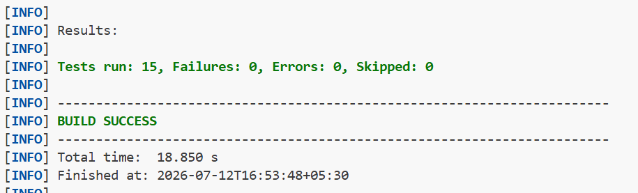
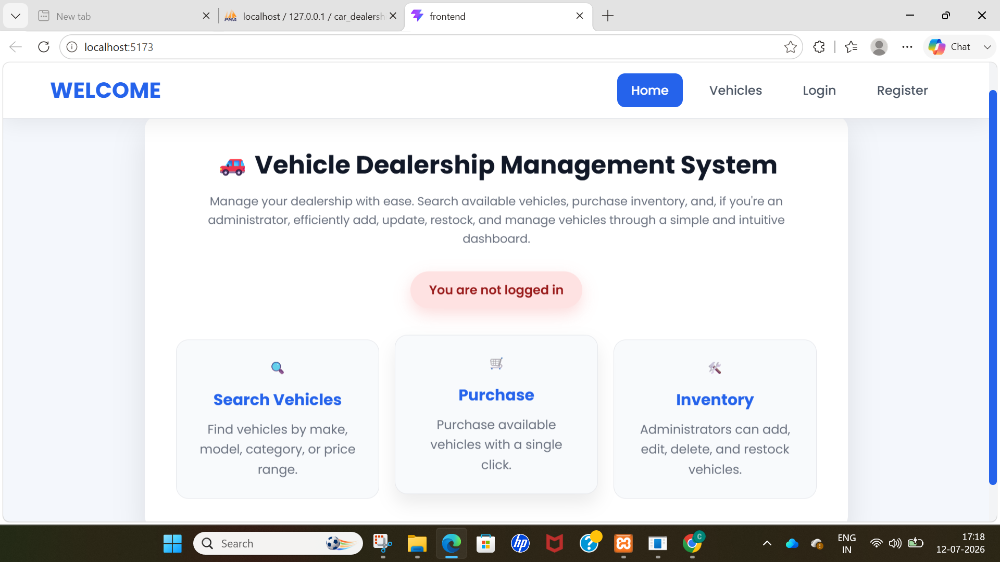
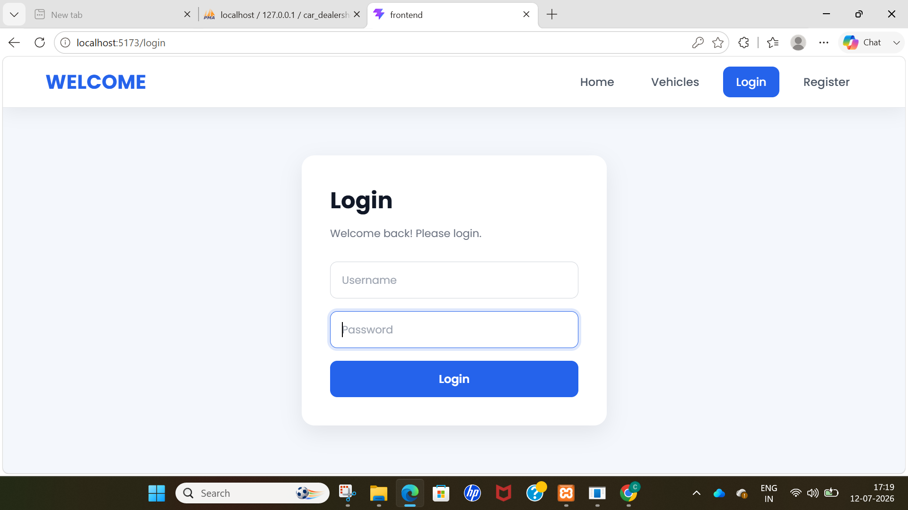
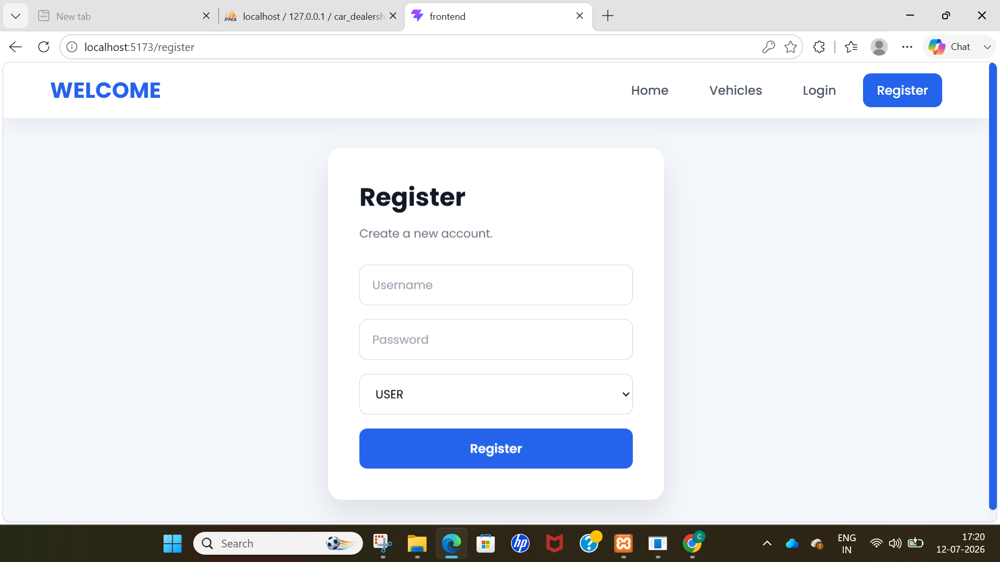
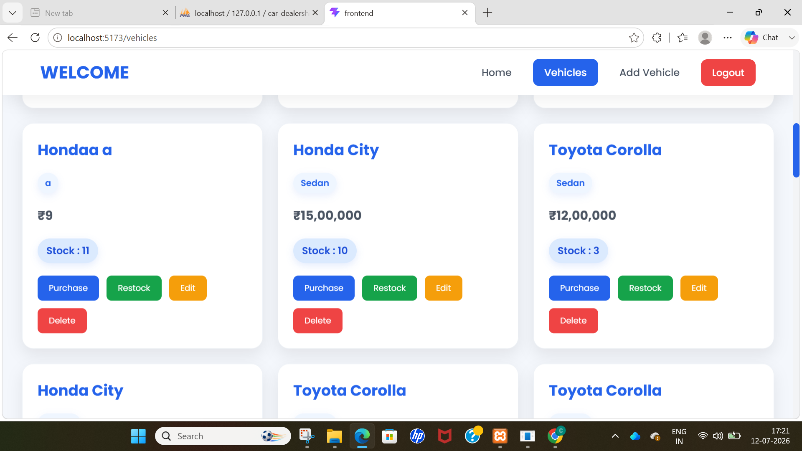
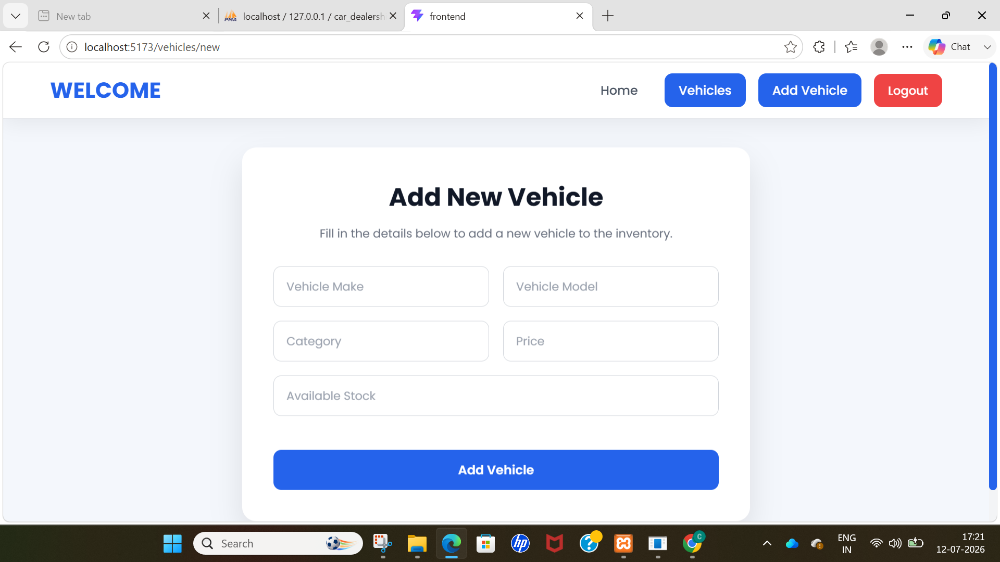
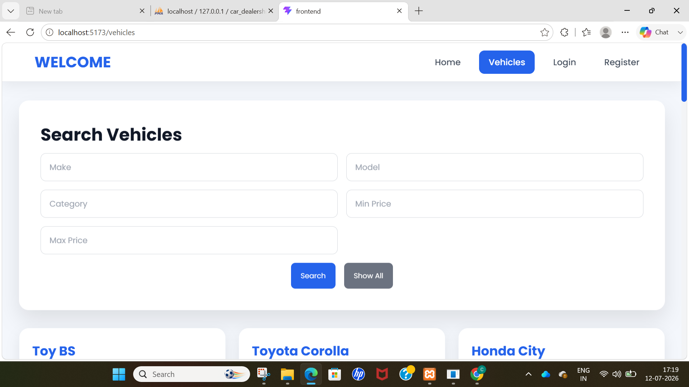

# Car Dealership Inventory System

A full-stack Car Dealership Inventory System built as part of the Incubyte Software Craftsperson Intern assessment.

## Tech Stack

### Backend
- Java
- Spring Boot
- Spring Security
- Spring Data JPA
- MySQL
- JWT

### Frontend
- React
- Vite
- Axios
- Bootstrap

## Features

- User Registration
- User Login
- JWT Authentication
- Vehicle CRUD
- Vehicle Search
- Purchase Vehicles
- Restock Vehicles
- Role-based Authorization

## Project Structure

```text
incubyte-tdd/
│
├── backend/
│   ├── src/
│   │   ├── main/
│   │   │   ├── java/com/incubyte/backend/
│   │   │   │   ├── config/
│   │   │   │   ├── controller/
│   │   │   │   ├── dto/
│   │   │   │   ├── entity/
│   │   │   │   ├── exception/
│   │   │   │   ├── mapper/
│   │   │   │   ├── repository/
│   │   │   │   ├── security/
│   │   │   │   ├── service/
│   │   │   │   │   └── impl/
│   │   │   │   └── util/
│   │   │   └── resources/
│   │   └── test/
│   │       └── java/com/incubyte/backend/
│   │           ├── controller/
│   │           ├── integration/
│   │           ├── security/
│   │           └── service/
│   ├── pom.xml
│   └── mvnw
│
├── frontend/
│   ├── public/
│   ├── src/
│   │   ├── api/
│   │   ├── assets/
│   │   ├── components/
│   │   ├── context/
│   │   ├── hooks/
│   │   ├── layouts/
│   │   ├── pages/
│   │   ├── services/
│   │   ├── styles/
│   │   └── utils/
│   ├── package.json
│   └── vite.config.js
│
├── screenshots/
├── README.md
└── .gitignore

```

## Setup

# 🚀 How to Run the Project

## Prerequisites

Make sure the following software is installed:

- Java 17 or later
- Maven
- Node.js (v18 or later)
- npm
- MySQL
- Git

---

## 1. Clone the Repository

```bash
git clone https://github.com/atik2610/incubyte-tdd
cd incubyte-tdd
```

---

## 2. Setup MySQL Database

download XAMPP control panel
Start apache
Start mysql
click on admin button of mysql

Create a MySQL database:

```sql
CREATE DATABASE car_dealership;
```

Update the database configuration in:

```
backend/src/main/resources/application.properties
```

Example:

```properties
spring.datasource.url=jdbc:mysql://localhost:3306/car_dealership
spring.datasource.username=root
spring.datasource.password=your_password
spring.jpa.hibernate.ddl-auto=update
```

---

## 3. Run the Backend

Open a terminal inside the backend folder.

```bash
cd backend
```

Run the application:

```bash
mvn spring-boot:run
```

The backend will start on:

```
http://localhost:8080
```

---

## 4. Run the Frontend

Open another terminal.

```bash
cd frontend
```

Install dependencies:

```bash
npm install
```

Start the React application:

```bash
npm run dev
```

The frontend will be available at:

```
http://localhost:5173
```

---

## 5. Login

Register a new account from the Register page.

Select one of the following roles:

- USER
- ADMIN

Then login using the registered credentials.

---

## Features

### USER

- View all vehicles
- Search vehicles
- Purchase available vehicles

### ADMIN

- Add new vehicles
- Edit vehicle details
- Delete vehicles
- Restock vehicles
- Search vehicles

---

## Tech Stack

### Backend

- Java
- Spring Boot
- Spring Security
- JWT Authentication
- Spring Data JPA
- MySQL
- Maven

### Frontend

- React
- Vite
- React Router
- CSS

---

## Notes

- Backend runs on **http://localhost:8080**
- Frontend runs on **http://localhost:5173**
- Ensure MySQL is running before starting the backend.

## Testing

Performed unit testing and integration testing as per requirement.

## My AI Usage

I mainly used chatgpt.I gave my file to AI tools and ask them to remember it.then i give them proper prompt regarding 'what exactly we need to do?'.Then i manually review code and update it.

Some of my propt example which were used while developing this project:

I have a React application with three pages: Home, Login, and Register. I want to improve only the UI using plain CSS (no Tailwind, Bootstrap, Material UI, Chakra UI, or other CSS frameworks).

Requirements:

Keep all existing React functionality exactly the same.
Do not modify any JavaScript logic or API calls.
Only add CSS and, if necessary, minimal className attributes to the JSX.
Create a modern, clean, responsive design.
Center the Login and Register forms on the page.
Put the forms inside white card containers with rounded corners and subtle shadows.
Style the navigation bar with a modern look and highlight the active page.
Style buttons with hover and active effects.
Style input fields with proper padding, rounded borders, focus effects, and spacing.
Style the Home page with a welcome card that clearly displays the login status.
Use a professional color palette (white, light gray, blue accents).
Make the layout responsive for mobile, tablet, and desktop.
Add smooth transitions and hover animations.
Use a modern font such as Inter, Poppins, or Roboto.
Keep the design minimal and suitable for a professional web application.

Please provide:

Updated JSX with only the required className additions.
A complete index.css file (or separate CSS files if preferred).
Ensure the application works exactly as before after adding the CSS.

"Extend my existing React + Spring Boot Car Dealership Inventory System. I already have Login, Register, and Home pages working with JWT authentication stored in localStorage. Now implement the Vehicles feature while keeping the existing project structure and styling.

Requirements:

Create vehicleApi.js with:
getVehicles() → calls GET /api/vehicles with Authorization: Bearer <token>.
createVehicle(vehicle) → calls POST /api/vehicles with JWT token.
Create Vehicles.jsx that fetches and displays all vehicles on page load.
Create AddVehicle.jsx with a form for make, model, category, price, and quantity. On successful creation, redirect to /vehicles.
Update App.jsx to:
Add routes for /vehicles and /vehicles/new.
Add navigation links for Vehicles and Add Vehicle.
Implement Logout directly in App.jsx: if a JWT token exists in localStorage, hide Login/Register and show a Logout button instead. Clicking Logout should remove the token, navigate to /login, and optionally show a success alert. Refactor App.jsx if necessary so useNavigate() works correctly.
Reuse my existing CSS and component style (page, card, auth-card, btn, input) so the new pages match the current UI.
Keep the code clean, beginner-friendly, and consistent with my existing project structure."

I have a React application for a Car Dealership Inventory System.

Current setup:
- I already have getVehicles(), createVehicle(), and deleteVehicle() API functions.
- I also have updateVehicle(id, vehicle) which sends a PUT request to /api/vehicles/{id}.
- Vehicles are displayed using useEffect and useState.

Modify my existing Vehicles.jsx page to support editing a vehicle.

Requirements:
1. Add an Edit button beside each vehicle.
2. When Edit is clicked, allow the user to modify make, model, category, price, and quantity.
3. Use the existing updateVehicle(id, vehicle) API function.
4. After a successful update, immediately update the React state so the page refreshes without reloading.
5. Handle API errors with alert().
6. Keep the implementation simple using React hooks (useState/useEffect).
7. Do not use Redux or external libraries.
8. Return the complete updated Vehicles.jsx file.


I have a React + Vite vehicle dealership application. Please improve the UI by adding modern, responsive CSS only.

Requirements:
- Do NOT change any React component logic, API calls, routing, or functionality.
- Only modify CSS (or add CSS classes where absolutely necessary).
- Use a clean, professional dashboard-like design.
- Use the Poppins font.
- Keep the color palette primarily white, blue (#2563eb), and light gray.
- Make the UI fully responsive for desktop, tablet, and mobile.

Pages:
1. Home
   - Attractive welcome card.
   - Modern logged-in / not logged-in status badge.

2. Login
   - Centered login card.
   - Modern input fields with focus effects.
   - Attractive login button with hover animation.

3. Register
   - Same style as Login.
   - Beautiful select dropdown for role.

4. Add Vehicle
   - Professional form layout.
   - Equal-width inputs.
   - Modern submit button.

5. Vehicles
   - Replace the plain list with modern cards.
   - Each vehicle should appear inside its own card.
   - Display Make, Model, Category, Price, and Stock neatly.
   - Search section should be inside a separate card.
   - Buttons (Purchase, Restock, Edit, Delete) should have different colors.
   - Add spacing, shadows, rounded corners, and hover effects.
   - Make the layout responsive.

Navbar:
- Modern sticky navigation bar.
- Highlight the active page.
- Attractive Logout button.
- Smooth hover animations.

Buttons:
- Rounded corners.
- Hover animations.
- Active click effect.
- Disabled state styling.

Forms:
- Rounded inputs.
- Blue focus border and shadow.
- Consistent spacing.

Cards:
- Rounded corners.
- Soft shadows.
- Hover lift animation.

Animations:
- Smooth transitions.
- Fade-in animation for pages.
- Hover effects for cards and buttons.

Important:
- Do not modify JavaScript logic.
- Do not change component functionality.
- Generate a complete, production-quality CSS file (index.css) that works with the existing React components.

### Test-case passed proof



### Frontend Photos

## 🏠 Home Page



---

## 🔐 Login



---

## 👤 Register



---

## 🚗 Vehicles



---

## ➕ Add Vehicle



---

## 🔍 Search Vehicles

